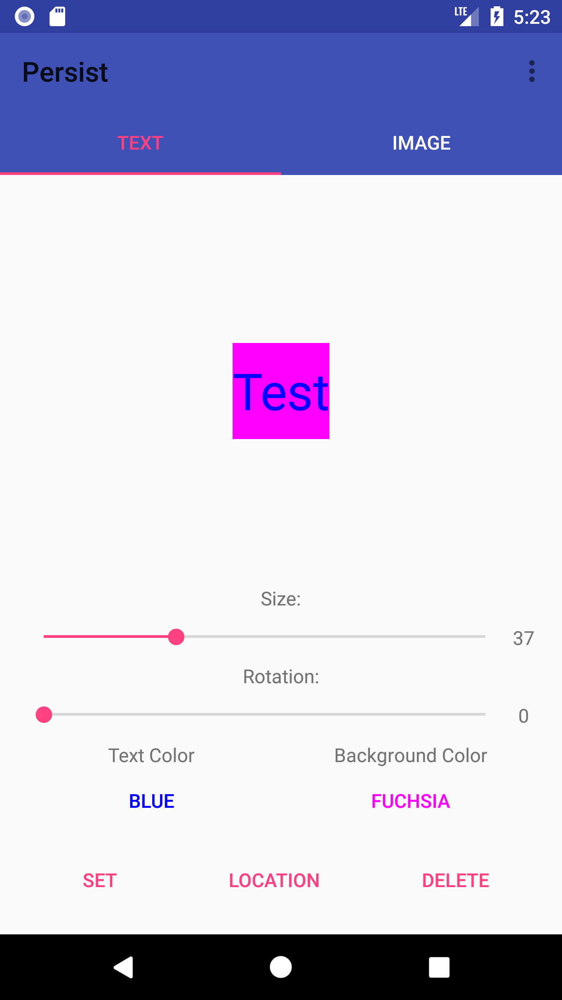
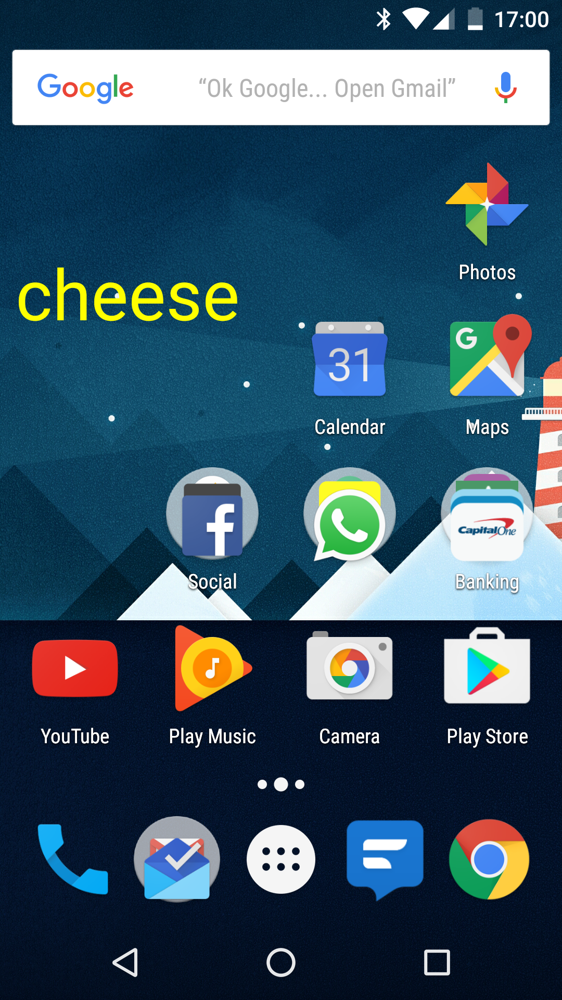
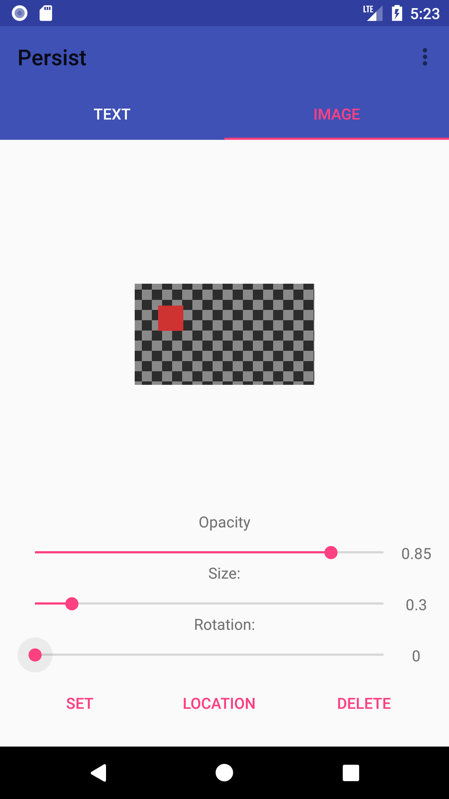
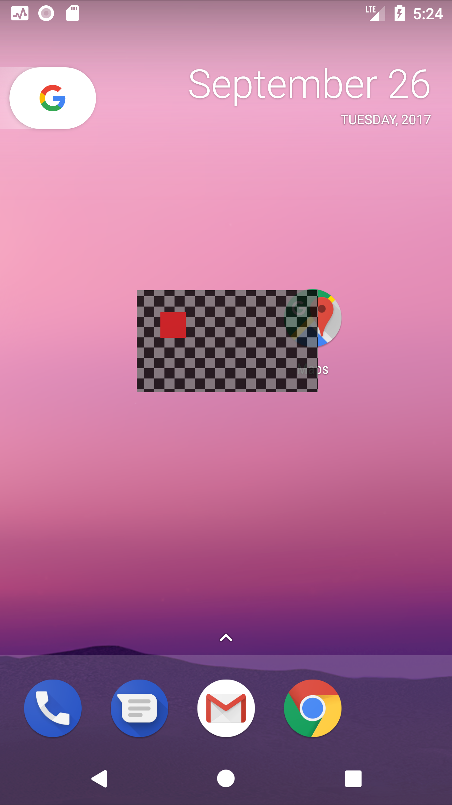

# Persist-App

Leave reminders or messages on the screen of your device that persists through all apps. The message will try to reset even when closing the app and after reboots.

Select the size, text color, background color, and location of your message and set it to the screen of your device. The message will persist until hitting the delete button.
Allows for a constant reminder

Image support has also been added giving the ability to add a picture from the camera or gallery within the app.

Finally, contains widget support for setting text onto the screen without going through all apps.

**Text Setting**

**Image Setting**

